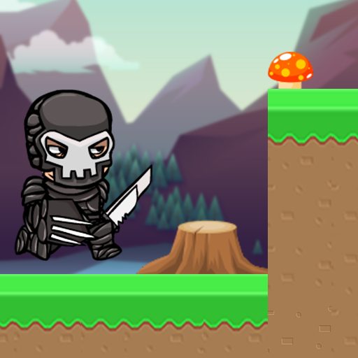

# AstroRun
AstroRun is an indie game developed by a small team of 3 people. It's about a lost adventurer in space, that has to complete different levels which are all part from a diverse collection of worlds. Each world is based around a certain theme and has its own unique intractable objects such as trampolines, falling spikes, enemies, turrets and much more for you to discover. On his way, the adventurer can collect a variety of items which can be used to buy new packages and accessories.

# Playing the game
You can try out the game  for yourself by downloading it from the [Play Store](https://play.google.com/store/apps/details?id=com.jam54.AstroRun)

# Getting the project
To get the project folder you will need to clone the project using **Git** and **Git LFS**.

> __IMPORTANT__: 
> This project uses Git Large Files Support (LFS). Downloading a zip file using the green button on Github
> **will not work**. You must clone the project with a version of git that has LFS.
> You can download Git LFS here: https://git-lfs.github.com/.

## Getting the right version of Unity

Once you have cloned the repository, you should install
the most recent stable version of Unity. Make sure you include
both the android build support in your installation.

## Opening the project for the first time

The following guide should take you to the point where
you can hit play in the editor and run around the levels and also build a
standalone version of the game.

### Part 1

## Development of AstroRun

AstroRun was previously known under the name RiolRat, but this was later changed to a more appealing name.
It is currently being developed by a small team of 3 people, that consists of a programmer, level designer and a music composer.
