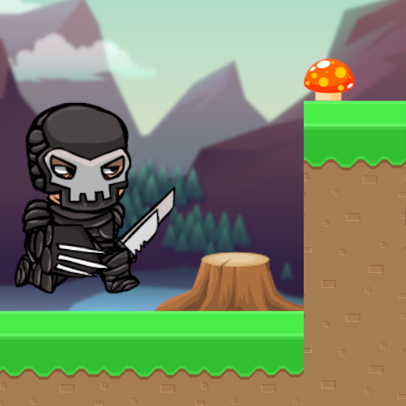

# AstroRun
AstroRun is an indie game developed by a small team of three people. It's about a lost adventurer in space, who must complete various levels that are all part of a diverse collection of worlds. Each world is based around a certain theme and has its own unique intractable objects such as trampolines, falling spikes, enemies, turrets and much more. Along the way, the adventurer can collect various items which can be used to purchase new packages and accessories.

 

# Playing the game
You can try out the game for yourself either by using the [Jam54 Launcher](https://jam54.com/download.html), by downloading the APK directly from [here](https://jamhorn.github.io/Jam54Launcher/7/resources/AstroRun.apk) or by checking it out on the [Google Play Store](https://play.google.com/store/apps/details?id=com.jam54.AstroRun).

 

## The development of AstroRun
AstroRun was previously known under the name RiolRat, but this was later changed to a more appealing name.  
Although nowadays most of the work is done by the programmer. The game used to be developed by a small team of 3 people, which consisted of a programmer, a level designer and a music composer. 

 

## Documentation
### Opening the project for the first time
- [Cloning the repository & installing the correct version of the Unity editor](/Documentation/Cloning&UnityVersion.md)
- [Error handling](/Documentation/ErrorHandling.md)

### [Adding new levels](/Documentation/AddNewLevel.md)

### [Adding new skins](/Documentation/AddNewSkin.md)

### [Building the project](/Documentation/BuildingTheGame.md)

### [Capturing device logs on Android](/Documentation/CaptureAndroidLogs_AdbLogcat.md)

### [Achievements and leaderboards](/Documentation/AchievementsAndLeaderboards.md)
